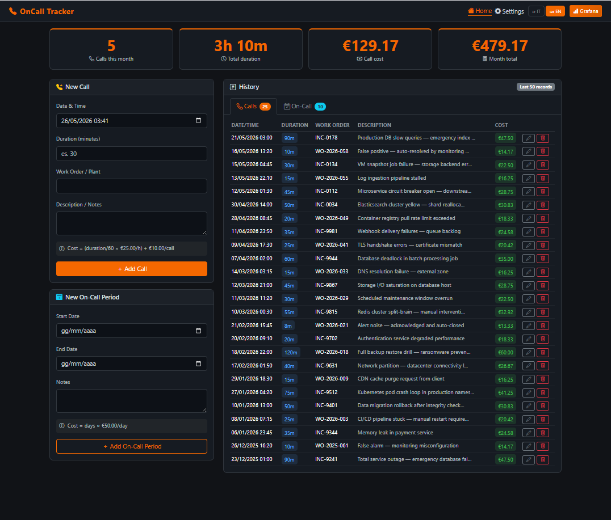
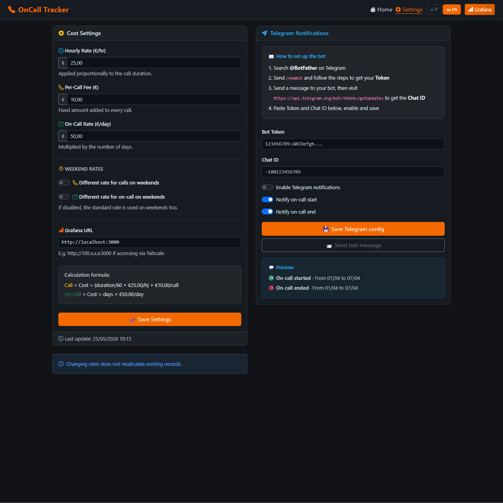
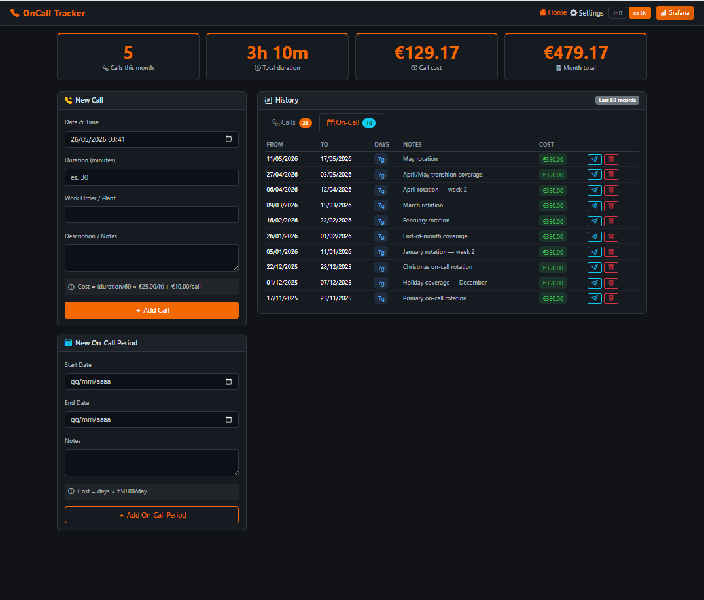
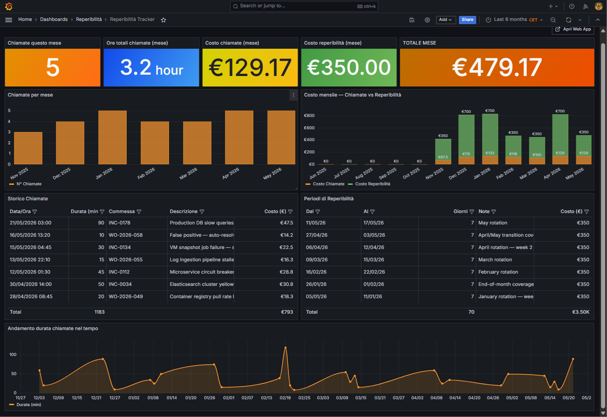

# OnCall Tracker

[](https://www.docker.com/)
[](https://www.postgresql.org/)
[](https://grafana.com/)
[](LICENSE)

I always struggled to keep track of my OnCall and InCall shifts, so I decided to build this Docker container.

I access it from my smartphone or laptop via Tailscale, and it runs on a home Linux server.  
A small Grafana dashboard is included

The code has been mostly developed with Claude Code.

---

## Screenshots

### Home — Dashboard & Call Logging



Stats cards for the current month, call entry form, on-call period form, and full history table with edit/delete actions.

---

### Settings — Costs, Weekend Rates & Telegram



Configure standard rates, enable optional weekend surcharges for calls and/or on-call periods, set the Grafana URL for Tailscale access, and manage the Telegram bot connection.

---

### On-Call History with Telegram Notifications



On-call periods with automatic weekend rate detection.

---

## Quick Start

```bash
git clone https://github.com/MirkoCesari/oncall-tracker.git
cd oncall-tracker

docker compose up -d --build
```

Wait ~30 seconds, then:

| Service  | URL                    | Credentials   |
|----------|------------------------|---------------|
| Web App  | http://localhost:5000  | —             |
| Grafana  | http://localhost:3000  | admin / secret |

---

## Cost Model

| Parameter | Default | Description |
|-----------|---------|-------------|
| Hourly rate | €25.00/hr | Applied proportionally to call duration |
| Per-call fee | €10.00 | Fixed fee added to every call |
| On-call daily rate | €50.00/day | Multiplied by number of days in period |

```
Call cost    = (duration_min ÷ 60 × hourly_rate) + per_call_fee
On-call cost = Σ daily_rate(day) for each day in period
```

**Weekend rates** (optional): enable separate rates for Sat/Sun independently for calls and on-call periods.  

---  

## Grafana Dashboard



Auto-provisioned on first start. Includes stat cards, monthly bar charts (calls + costs stacked), filterable history tables, and a time series of call durations.

Set your Tailscale IP in **Settings → Grafana URL** (e.g. `http://100.x.x.x:3000`) so the navbar button works remotely.

---

## Telegram Notifications

1. Open Telegram → **@BotFather** → `/newbot` → copy the **Token**
2. Send a message to your bot → visit `https://api.telegram.org/bot<TOKEN>/getUpdates` → copy the **Chat ID**
3. Go to **Settings → Telegram** → paste Token and Chat ID → enable → save

| Event | Trigger |
|-------|---------|
| 🟢 On-call started | Automatic on period insert |
| 🔴 On-call ended | Manual via send button on each row |
| ✅ Test | "Send test message" button |

---

## License

MIT — see [LICENSE](LICENSE).